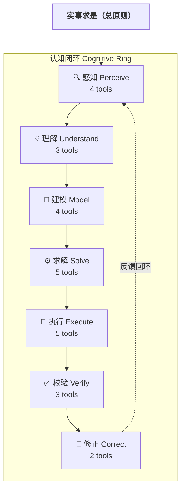
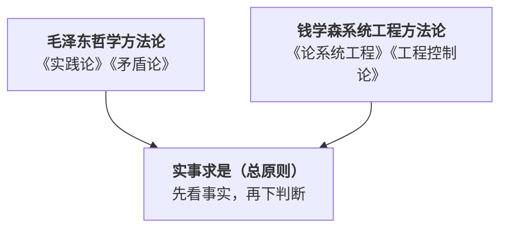

# 求是系统工程方法论 Skill 体系

> 实事求是 + 系统工程 + 工程控制论 → AI Agent 方法论工具链
> 
> 🏗️ 本项目基于 [HughYau/qiushi-skill](https://github.com/HughYau/qiushi-skill) 改造，继承其「实事求是」总原则与毛泽东思想方法论根基，扩展钱学森系统工程方法论，重构为七环认知闭环架构。

## 这是什么

一套为 AI Agent 设计的方法论 skill 集合。27 个 skill（感知 3 + 理解 3 + 建模 4 + 求解 5 + 执行 5 + 校验 3 + 修正 2 + 元能力 2）覆盖 agent 认知闭环的七个环节——从感知到修正，使 agent 在面对复杂任务时能够：

- 摸清现状再判断（感知）
- 抓住本质和主要矛盾（理解）
- 建立系统模型（建模）
- 在约束下求最优解（求解）
- 有序推进不散乱（执行）
- 验证偏差不盲信（校验）
- 根据反馈自校正（修正）

## 组织原则：认知环，而非思想来源

这套体系的组织逻辑不是「毛泽东的方法 vs 钱学森的方法」。



每个认知环节下，毛泽东的哲学方法论和钱学森的工程方法论**协同工作**，而非互斥。例如在「感知」环节，`investigation-first`（调查一手事实，毛泽东）和 `state-estimation`（从噪声推断状态，钱学森）用于不同子任务但服务于同一个认知目标。

## 哲学根基



## 27 个 Skill 速查

### 感知（Perceive）——「我面对的是什么？」

| Skill | 一句话 | 来源 |
|-------|--------|------|
| `investigation-first` | 先调查再发言（哲学模式）或构建结构化知识地图（工程扩展模式） | 毛泽东《反对本本主义》+ 钱学森《论系统工程》 |
| `mass-line` | 收集→集中→返回→检验，整合多方意见 | 毛泽东《关于领导方法的若干问题》 |
| `state-estimation` | 从噪声数据中递推推断隐藏状态 | 钱学森、宋健《工程控制论》第14-15章 |

### 理解（Understand）——「本质是什么？主要矛盾在哪？」

| Skill | 一句话 | 来源 |
|-------|--------|------|
| `first-principles-analysis` | 剥离假设到不可再分，再从基本元素向上重建 | 亚里士多德/笛卡尔/钱学森《工程控制论》第1章 |
| `historical-evolution-analysis` | 追溯因果链→识别路径依赖→分离偶然与必然，理解系统怎么变成现在这样 | 钱学森《论系统工程》《工程控制论》 |
| `contradiction-analysis` | 识别矛盾→判定主次→确定主攻方向 | 毛泽东《矛盾论》 |

### 建模（Model）——「怎么描述这个系统？」

| Skill | 一句话 | 来源 |
|-------|--------|------|
| `systems-thinking-framework` | 六步建立系统世界观：目的→边界→组分→层次→涌现→反馈 | 钱学森《论系统工程》 |
| `system-boundary-structuring` | 层次分解→组分规格→接口契约→五维边界检查 | 钱学森《论系统工程》 |
| `quantitative-modeling-workflow` | 定性假设→变量识别→建模方法选择→模型构建 | 钱学森《论系统工程》 |
| `meta-synthesis-engine` | 定性判断 + 定量结果 + 经验 → 综合集成结论 | 钱学森《论系统工程》 |

### 求解（Solve）——「在约束下，最优方案是什么？」

| Skill | 一句话 | 来源 |
|-------|--------|------|
| `constrained-optimization` | 约束下最优决策：极大值原理 + 动态规划 | 钱学森、宋健《工程控制论》第8-9章 |
| `hierarchical-decomposition-coordination` | 分解为自治子系统 + 协调层防全局恶化 | 钱学森、宋健《工程控制论》第21章 |
| `duality-complementarity-analysis` | 正向不通→构造对偶→求解→翻译回来 | 钱学森、宋健《工程控制论》第4/8/13章 |
| `perturbation-progressive-method` | 先解标称问题→一阶摄动→逐步加回复杂因素 | 钱学森、宋健《工程控制论》第13章 |
| `multi-representation-equivalence-transform` | 时域↔频域↔状态空间↔几何 等价切换 | 钱学森、宋健《工程控制论》第2章 |

### 执行（Execute）——「怎么落地？」

| Skill | 一句话 | 来源 |
|-------|--------|------|
| `engineering-orchestration` | WBS→关键路径→质量门→风险矩阵，编排为可执行任务序列 | 钱学森《论系统工程》 |
| `concentrate-forces` | 多任务中确定主攻方向，集中资源逐一歼灭 | 毛泽东十大军事原则 |
| `spark-prairie-fire` | 从零起步，找最小可行切入点建立根据地 | 毛泽东《星星之火，可以燎原》 |
| `protracted-strategy` | 长期任务分阶段：防御→相持→反攻 | 毛泽东《论持久战》 |
| `overall-planning` | 多个目标相互制约时做动态平衡 | 毛泽东《论十大关系》 |

### 校验（Verify）——「做得对吗？」

| Skill | 一句话 | 来源 |
|-------|--------|------|
| `practice-cognition` | 实践→认识→再实践的螺旋，全环节方法论约束 | 毛泽东《实践论》 |
| `simulation-validation-cycle` | 多场景仿真 + 边缘条件测试 | 钱学森《论系统工程》 |
| `feedback-and-revision-loop` | 阶段偏差量化→五层根因追溯→三级修正 | 钱学森《论系统工程》 |

### 修正（Correct）——「怎么改？」

| Skill | 一句话 | 来源 |
|-------|--------|------|
| `criticism-self-criticism` | 结构化审视工作质量和思维过程 | 毛泽东《整顿党的作风》 |
| `adaptive-robust-strategy` | 自寻优→自行镇定→模型参考自适应，在不确定中保持最优 | 钱学森、宋健《工程控制论》第16/18章 |

### 元能力（Meta）

| Skill | 一句话 |
|-------|--------|
| `arming-thought` | 实事求是总原则 + 认知环路由器 |
| `workflows` | 三条标准化跨环节工作流 |

---

## 使用

在任何对话中，`arming-thought` 会自动加载并建立「实事求是」总原则。当你遇到匹配的场景时，系统会根据认知环节路由到对应的 skill。

skill 的调用由描述中的触发条件自动匹配。你也可以显式调用：

```
/skill first-principles-analysis
```

## 设计原则

1. **认知环组织**：按 agent 的实际认知流程组织，而非按思想来源
2. **双源协同**：毛泽东方法和钱学森方法在同一认知环节下互补
3. **分层不割裂**：每个技能独立可用，也可以完整串联
4. **原著为锚**：每个 skill 标明了在原著中的出处
5. **操作化输出**：每个 skill 有明确的步骤、触发条件、不适用场景和常见错误
6. **宁可承认不知道**：不确定时返回调查，而非用猜测填补

## 🔌 平台支持

| 平台 | 安装方式 | 自动注入 |
|------|---------|---------|
| **Reasonix** | `powershell -File .reasonix/setup.ps1` 或见 [REASONIX.md](REASONIX.md) | ✅ 技能索引发现 |
| **Claude Code** | `claude plugin add .` | ✅ SessionStart hook |
| **Cursor** | 注册插件路径 | ✅ plugin.json |
| **Codex** | 见 [.codex/INSTALL.md](.codex/INSTALL.md) | 手动 |
| **OpenCode** | 见 [.opencode/INSTALL.md](.opencode/INSTALL.md) | 手动 |

## 版本

- v3.2：Reasonix 原生支持 + 轻量路由 + 合并双调研 + 操作边界 + 演练案例 + 验证脚本
- v3.1：系统层次意识（物理/工程/产品/社会-技术），防层次错位
- v3.0：重构为认知环架构
- v2.1：新增最优决策、状态估计、自适应策略
- v2.0：钱学森系统工程方法论 + 工程控制论层
- v1.0：初始版本，基于 [HughYau/qiushi-skill](https://github.com/HughYau/qiushi-skill) 的 11 个技能

## 致谢

本项目起源于 [HughYau/qiushi-skill](https://github.com/HughYau/qiushi-skill)，感谢原作者将毛泽东哲学方法论提炼为可操作的 AI Agent 技能体系。

本项目的核心贡献在于：
- 引入钱学森系统工程方法论（《工程控制论》《论系统工程》），与毛泽东哲学方法形成双源协同
- 将 11 个技能扩展至 27 个，重构为七环认知闭环架构
- v3.2 新增 Reasonix 原生支持、轻量路由、操作边界、演练案例

**知识属于人民。** 本项目继承原始 MIT 协议，保持开源。
